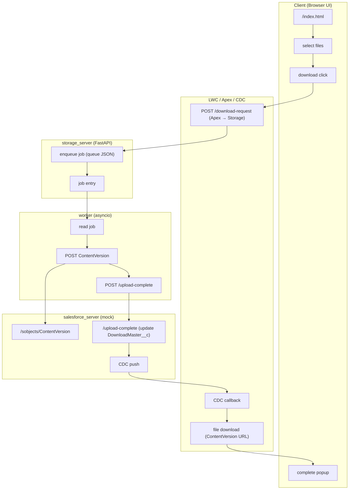

# Local Async File Download Demo

Salesforce 互換 API を用いた **非同期ファイルダウンロード処理** を  
ローカル環境で完全再現するデモプロジェクトです。

- Salesforce® は一切不要（完全ローカルのモック環境）
- LWC → Apex → Storage → Worker → Mock Salesforce → CDC の一連の流れを再現
- Chunk Upload / 非同期処理 / 状態管理 / ログ基盤を統合

詳細な技術ドキュメントは `/docs` に分割されています。

---

## 🚀 Quick Start

### 0. Setup Sample Data

```bash
pip install -r requirements_dev.txt
source venv/bin/activate
python setup_sample_data.py
```

### 1. Install

```bash
python -m venv venv
source venv/bin/activate
pip install -r requirements.txt
```

### 2. Start Servers

```bash
run_servers.bat
```

### 3. Open UI

```
http://localhost:8000/index.html
```

---

## 🏗️ Architecture Overview



---

## 📚 Documentation

詳細ドキュメントは [/docs](docs/index.md) に整理されています。

- [/docs/overview.md](docs/overview.md)
- [/docs/architecture.md](docs/architecture.md)
- [/docs/lwc_flow.md](docs/lwc_flow.md)
- [/docs/storage_flow.md](docs/storage_flow.md)
- [/docs/worker_flow.md](docs/worker_flow.md)
- [/docs/queue.md](docs/queue.md)
- [/docs/logging.md](docs/logging.md)
- [/docs/api_reference.md](docs/api_reference.md)
- [/docs/troubleshooting.md](docs/troubleshooting.md)
---

## ⚠️ Note

本プロジェクトは Salesforce® の API を使用していません。  
すべてローカルで動作する **互換 API を持つモックサーバー**です。

---

## 📄 License

MIT License  
(Salesforce® is a trademark of Salesforce, Inc.)
```

