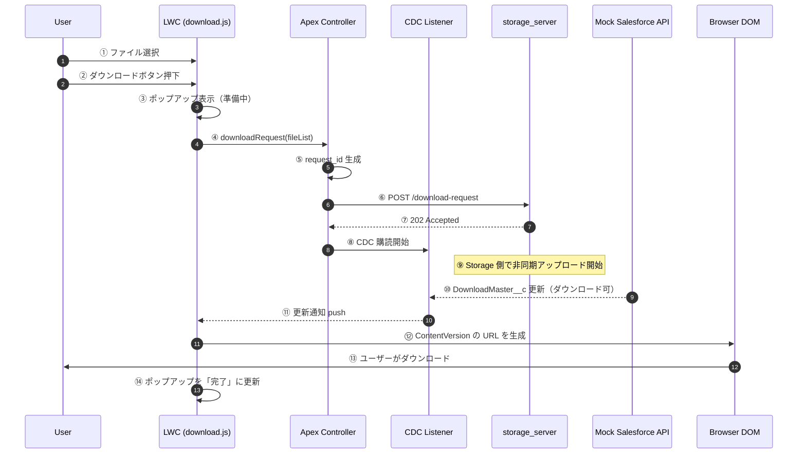
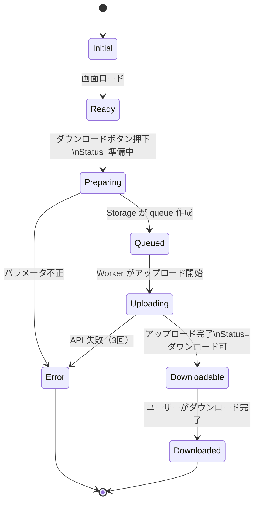

# LWC / Apex / CDC Flow

このドキュメントでは、Salesforce（モック）側の  
**LWC → Apex → Storage → CDC → LWC** の一連の動作をまとめています。

LWC はユーザー操作を受け取り、Apex を経由して Storage に非同期リクエストを送信し、  
CDC による DownloadMaster__c の更新通知を受けて UI を更新します。

---

# 📘 LWC 側の処理フロー（概要）

1. DownloadMaster__c を読み込み、画面に一覧表示  
2. ユーザーが複数ファイルを選択  
3. 「ダウンロード」ボタン押下  
4. ポップアップ表示（ステータス＝準備中）  
5. Apex が Storage の `/download-request` を呼び出す  
6. CDC により DownloadMaster__c の更新通知を受信  
7. ContentVersion の URL を DOM に追加  
8. ユーザーがファイルをダウンロード  
9. ポップアップを「完了」に更新  

---

# 🧩 シーケンス図（LWC / Apex / CDC）

# DownloadMaster__c の状態遷移（LWC 視点）

