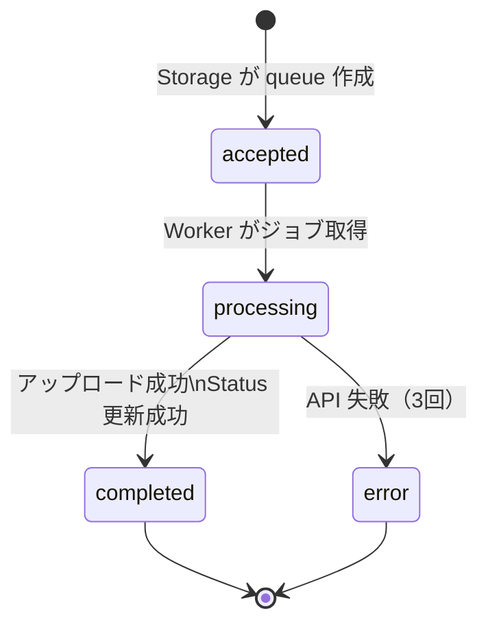
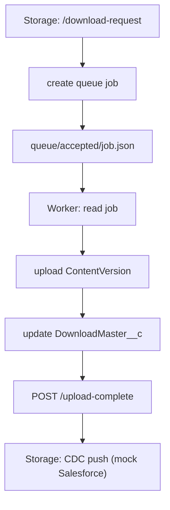

# Queue Management

Storage Server の非同期処理は、  
**「1 ファイル = 1 ジョブ」** の queue JSON によって制御されます。

このドキュメントでは、queue の構造・スキーマ・状態遷移・処理フローをまとめます。

---

# 📘 Queue の役割

- Storage Server が `/download-request` を受け取ると、  
  **ファイル単位で queue ジョブを作成**する
- Worker は queue を監視し、ジョブを処理する
- Worker の成功・失敗に応じて queue の状態が変化する
- DownloadMaster__c のステータス更新は Worker が担当
- request_id により LWC → Apex → Storage → Worker → Mock → CDC が一貫して紐づく

---

# 📁 Queue ディレクトリ構造

```text
project_root
 └── storage
      ├── files/
      └── queue/
           ├── accepted/     # 新規ジョブ
           ├── processing/   # Worker が処理中
           ├── completed/    # 正常終了
           └── error/        # エラー終了
```

---

# 📄 Queue JSON（ジョブファイル）スキーマ

```json
{
  "$schema": "http://json-schema.org/draft-07/schema#",
  "title": "QueueJob",
  "description": "Storage が生成する非同期ジョブ（1 ファイル = 1 ジョブ）",
  "type": "object",
  "properties": {
    "id": { "type": "string" },
    "filename": { "type": "string" },
    "filename_disp": { "type": ["string", "null"] },
    "encrypted_filepath": { "type": "string" },
    "extension": { "type": "string" },
    "request_id": { "type": "string" },
    "retry_count": { "type": "integer", "minimum": 0 },
    "last_error": { "type": ["string", "null"] },
    "status": {
      "type": "string",
      "enum": ["accepted", "processing", "completed", "error"]
    }
  },
  "required": [
    "id",
    "filename",
    "encrypted_filepath",
    "extension",
    "request_id",
    "status"
  ]
}
```

---

# 🧩 Queue JSON の例

```json
{
  "id": "DM-1",
  "filename": "file_1.txt",
  "encrypted_filepath": "gAAAAABp...",
  "extension": "txt",
  "request_id": "abc-123",
  "status": "accepted"
}
```

---

# 🔄 Queue の状態遷移図



---

# 🧪 Queue のライフサイクル（詳細）

## 1. accepted（新規ジョブ）
- `/download-request` を受けた Storage が作成
- 1 ファイルにつき 1 ジョブ
- Worker が監視対象とするディレクトリ

## 2. processing（Worker が処理中）
- Worker がジョブを取得すると `processing/` に移動
- 以下の処理を実行：
  - encrypted_filepath の復号
  - ファイル読み込み
  - chunk アップロード（ContentVersion）
  - ContentDocumentLink 作成
  - DownloadMaster__c のステータス更新

## 3. completed（正常終了）
- Worker がすべての処理を完了
- DownloadMaster__c が「ダウンロード可」に更新済み
- queue ファイルは `completed/` に移動

## 4. error（失敗）
- ContentVersion API が 3 回失敗
- DownloadMaster__c 更新 API が 3 回失敗
- download-request のパラメータ不正
- Worker が例外を検知した場合

---

# 🔗 Queue と Worker / Storage の関係図



