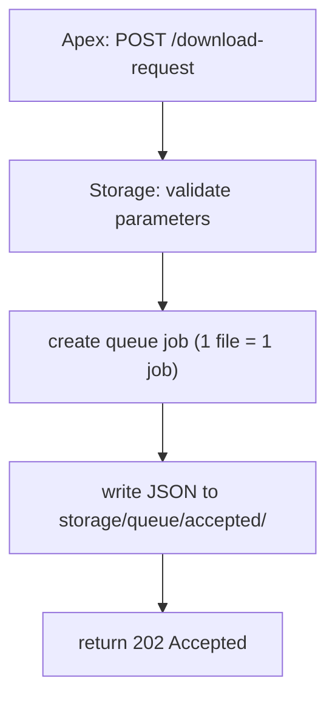
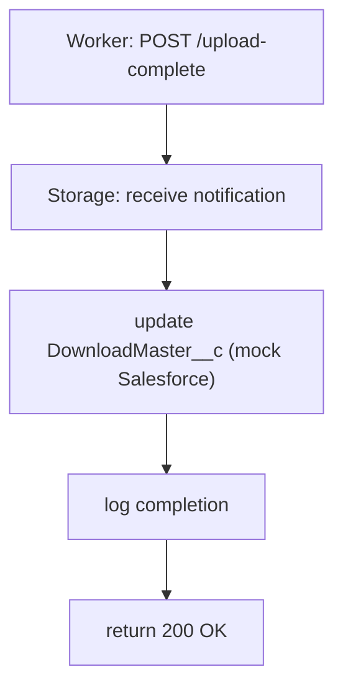
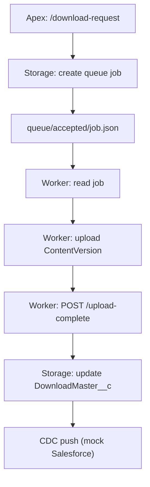

# Storage Server Flow

Storage Server（FastAPI）は、  
**LWC/Apex からのダウンロード要求を受け取り、queue にジョブを作成し、  
Worker の完了通知を受けて DownloadMaster__c を更新する役割** を担います。

このドキュメントでは、Storage Server の API と内部処理フローをまとめます。

---

# 📘 Storage Server の役割

- `/download-request` を受け取り、**1 ファイル = 1 ジョブ** の queue を生成
- Worker が処理しやすい JSON 形式でジョブを出力
- Worker からの `/upload-complete` を受け取り、DownloadMaster__c を更新
- request_id によるトレーシングを維持
- ログ基盤（structlog + contextvars）で全処理を記録

---

# 📨 `/download-request` の処理フロー

Apex → Storage に送られる最初の API。

## 処理ステップ

1. **パラメータ検証**  
   - file list  
   - request_id  
   - DownloadMaster__c の ID

2. **ジョブ生成**  
   - 1 ファイルにつき 1 ジョブ JSON を作成  
   - `storage/queue/accepted/` に保存

3. **ログ出力**  
   - trace_action により start/end ログを記録

4. **HTTP 202 Accepted を返却**  
   - 非同期処理であることを示す

---

# 🗂️ `/download-request` のフロー図



---

# 📄 Queue に書き込まれる JSON（例）

```json
{
  "id": "DM-1",
  "filename": "file_1.txt",
  "encrypted_filepath": "gAAAAABp...",
  "extension": "txt",
  "request_id": "abc-123",
  "status": "accepted"
}
```

---

# 🔄 `/upload-complete` の処理フロー

Worker が ContentVersion のアップロードを完了した後に呼び出す API。

## 処理ステップ

1. **完了通知を受信**
   - `{ id: "DM-1", status: "Completed" }`

2. **DownloadMaster__c のステータス更新**
   - モック Salesforce API を呼び出し  
   - Status = "ダウンロード可"

3. **ログ出力**
   - request_id に紐づく end ログを記録

4. **HTTP 200 OK を返却**

---

# 📨 `/upload-complete` のフロー図



---

# 🔗 Storage Server の全体フロー（まとめ）



