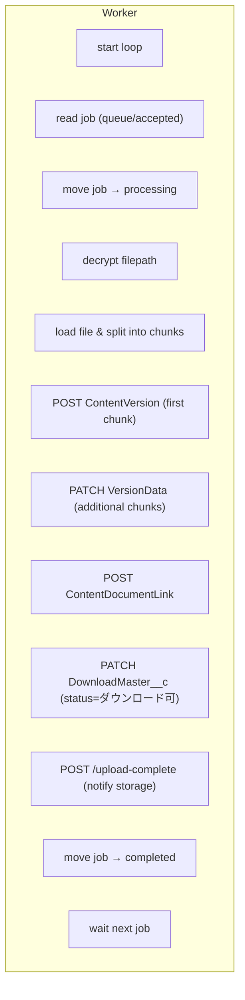
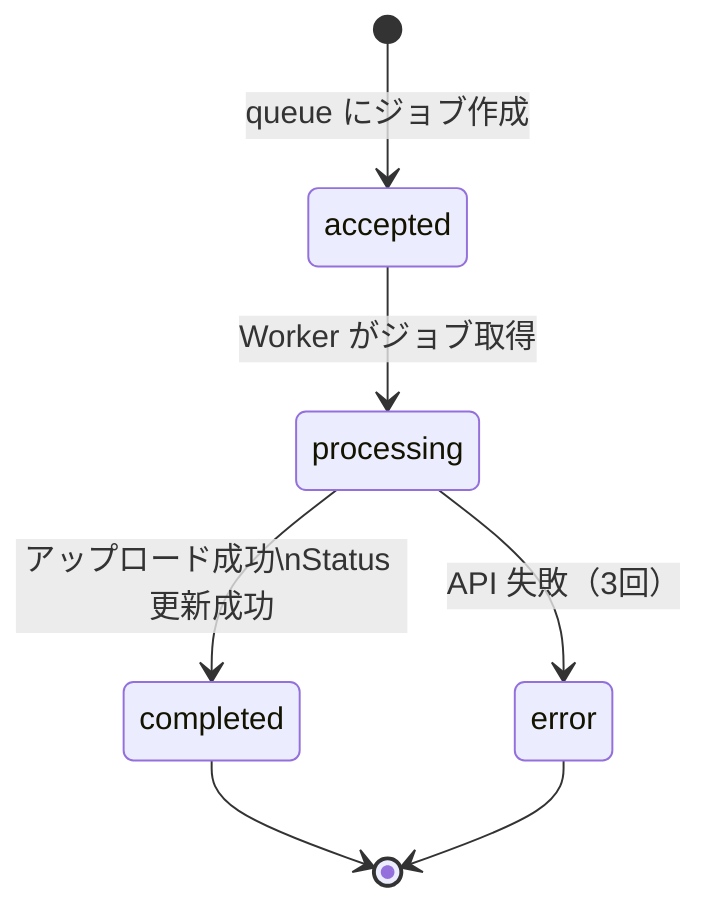

# Worker Flow

Worker は Storage Server が作成した **queue ジョブを非同期で処理し、  
Salesforce 互換 API にファイルをアップロードし、完了通知を返す役割** を担います。

このドキュメントでは、Worker の内部処理フローと API 呼び出し順序をまとめます。

---

# 📘 Worker の役割

- queue ディレクトリを監視し、新規ジョブを検知
- encrypted_filepath を復号し、実ファイルを読み込む
- ファイルを chunk に分割して ContentVersion API にアップロード
- ContentDocumentLink を作成して DownloadMaster__c と紐付け
- DownloadMaster__c のステータスを更新
- Storage Server に `/upload-complete` を通知
- 失敗時は最大 3 回リトライし、最終的に error 状態へ

---

# 🧩 Worker の内部フロー図



---

# 🔄 Worker の処理ステップ（詳細）

## 1. queue の監視
- `storage/queue/accepted/` を監視
- 新規ジョブ（JSON）を検知すると `processing/` に移動

## 2. encrypted_filepath の復号
- AES などで暗号化されたパスを復号
- Storage 内の実ファイルパスを取得

## 3. ファイル読み込み & chunk 分割
- 大きなファイルでもアップロードできるように chunk 化
- chunk サイズは任意（例：1MB）

## 4. ContentVersion の作成
- 初回 chunk → `POST /sobjects/ContentVersion`
- 追加 chunk → `PATCH /ContentVersion/{id}/VersionData`

## 5. ContentDocumentLink の作成
- `POST /sobjects/ContentDocumentLink`
- DownloadMaster__c と ContentDocument を紐付け

## 6. DownloadMaster__c のステータス更新
- `PATCH /sobjects/DownloadMaster__c/{id}`
- Status = "ダウンロード可"

## 7. Storage Server に完了通知
- `POST /upload-complete`
- Storage が CDC push をトリガー

## 8. ジョブの終了処理
- 正常終了 → `completed/` に移動  
- 失敗 → `error/` に移動（リトライ 3 回後）

---

# 🗂️ Worker の API 呼び出し順序

```text
1. POST   /services/oauth2/token
2. POST   /sobjects/ContentVersion
3. PATCH  /ContentVersion/{id}/VersionData
4. POST   /sobjects/ContentDocumentLink
5. PATCH  /sobjects/DownloadMaster__c/{id}
6. POST   /upload-complete
```

---

# 🧪 Worker の状態遷移



---

# 📝 補足

- Worker は **Storage Server と Mock Salesforce の両方に依存**  
- request_id により全ログが紐づく  
- Worker のログは `logs/worker.log` に出力  
- 失敗時は `retry_count` を更新しながら 3 回リトライ  

